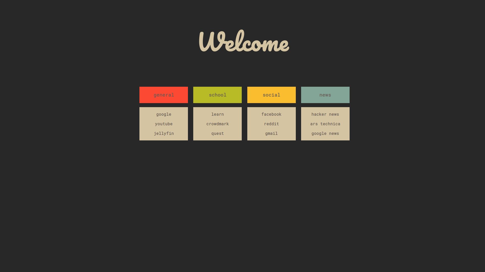
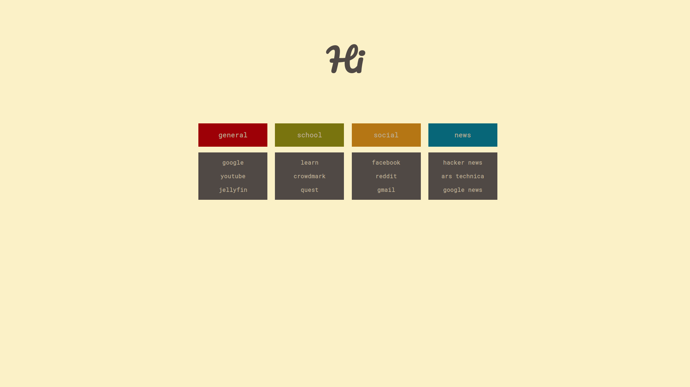

# Simon's startpage

This repo contains my new tab page. 

# Color management

The colorscheme of this homepage is handled by [pywal](https://github.com/dylanaraps/pywal).
Simply put the `startpage.css` file into `~/.config/wal/templates/` and wal will 
automatically populate the css file with a colorscheme. The screenshots were 
generated based off of `wal --theme base16-gruvbox-medium`, as well as the light 
variant of the same colorscheme.

# Credits

Thank you to [jasonlisdev](https://github.com/jasolisdev/.dotfiles) for 
providing the inspiration for this.
